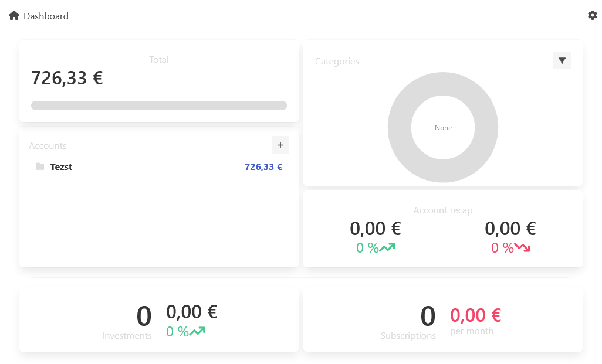

# MePloutos - accountancy
App to keep track of your finances



## Description

Features :
- Accounts
    - Transactions list imported from your bank
    - Add categories to transactions 
- Keep track of your investments
- Keep track of your subscriptions

Work as a PWA on any platform or as a native desktop app thanks to Tauri (experimental).

## Getting Started

### Dependencies

Install dependencies
```
npm install
```

### Executing program

Start development server
```
npm run dev
```
Start tauri app
```
npm run tauri dev
```

## Acknowledgments

Use :
- [Sveltkit](https://kit.svelte.dev/) for frontend
- [Bulma](https://bulma.io/) for styles
- [Dexie](https://dexie.org/) for DB
- [Tauri](https://tauri.app/) for desktop app
